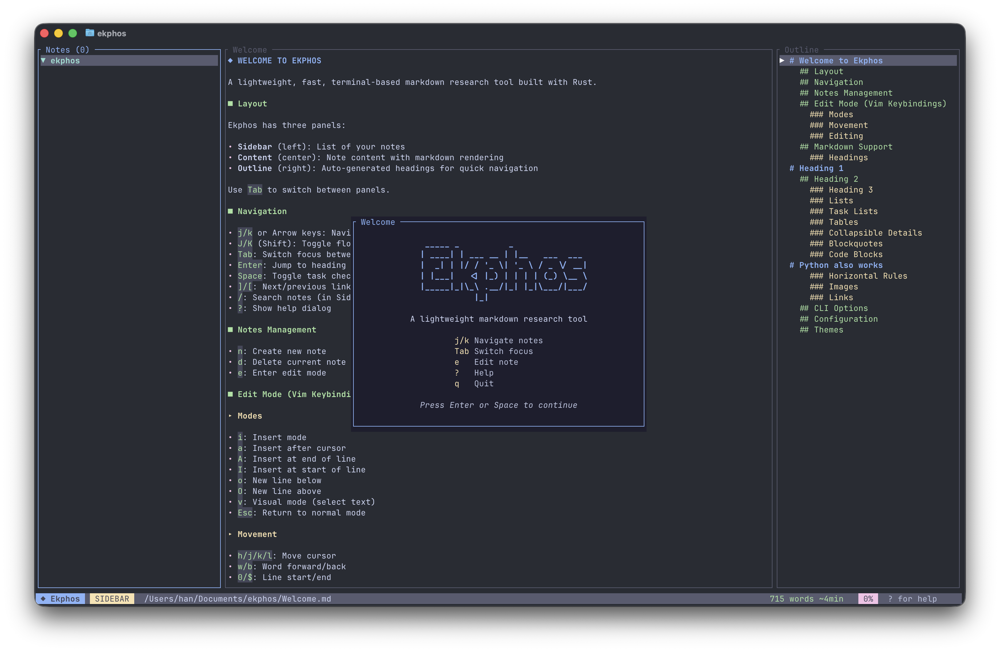

# Ekphos

[](https://crates.io/crates/ekphos)
[](https://www.rust-lang.org/)
[](https://github.com/hanebox/ekphos/blob/main/LICENSE)

An open source, lightweight, fast, terminal-based markdown research tool built with Rust.



## Documentation

**Go to [docs.ekphos.xyz](https://docs.ekphos.xyz)**

## Quick Start

To install with [Cargo](https://doc.rust-lang.org/cargo/):

```bash
cargo install ekphos
```

Alternatively, you can install Ekphos using [Homebrew](https://brew.sh):

```bash
brew install ekphos
```

Or using [AUR](https://aur.archlinux.org/packages/ekphos):

```bash
yay -S ekphos
```

_Note: Always update to the latest version. If you encounter config issues after updating, run `ekphos --reset` to reset your configuration._

## Requirements

- Rust 1.70+
- For inline images: iTerm2, Kitty, WezTerm, Ghostty, or Sixel-compatible terminal

## Discussion

- Open a discussion in the [repository](https://github.com/hanebox/ekphos/discussions)

## Disclaimer

This project is in early development. There may be breaking changes and bugs in pre-releases.

## Contributing

```bash
git clone https://github.com/hanebox/ekphos.git
cd ekphos
```

1. Fork the repository
2. Create a feature branch from `main`
3. Make your changes
4. Submit a PR to the `main` branch

To contribute to the documentation, see [ekphos-docs](https://github.com/hanebox/ekphos-docs).

[](https://repology.org/project/ekphos/versions)

## License

MIT
